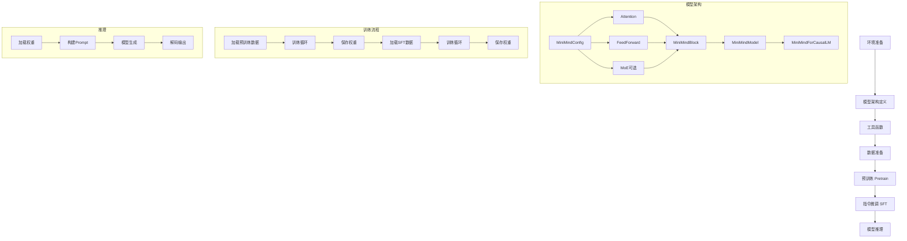

# MiniMind Jupyter Notebook 复刻计划

## 概述

本计划旨在将 minimind-master 项目的核心训练流程复刻为一个完整的 Jupyter Notebook，使用户可以在交互式环境中完成从预训练到 SFT 再到推理的全过程。

## Notebook 结构设计

Notebook 将包含以下主要部分（Cells）：

### 第一部分：环境准备

1. **依赖安装与导入**
   - 安装必要的 Python 包（torch, transformers, datasets 等）
   - 导入所有需要的模块
   - 检查 CUDA 可用性

2. **目录结构设置**
   - 创建必要的目录（out/, dataset/, checkpoints/）
   - 设置路径变量

### 第二部分：模型架构

3. **MiniMindConfig 定义**
   - 模型配置类（隐藏层维度、层数、MoE 等）
   - 默认参数说明

4. **模型核心组件**
   - RMSNorm
   - RoPE 位置编码（precompute_freqs_cis, apply_rotary_pos_emb）
   - Attention 机制（GQA）
   - FeedForward（SwiGLU）
   - MoE 前馈网络（可选）

5. **MiniMindBlock 与 MiniMindModel**
   - Transformer Block 定义
   - 完整模型堆叠

6. **MiniMindForCausalLM**
   - 因果语言模型头
   - forward 方法
   - generate 方法（推理核心）

### 第三部分：工具函数

7. **训练辅助函数**
   - setup_seed（随机种子设置）
   - get_lr（学习率调度）
   - Logger（日志输出）
   - get_model_params（参数量统计）

### 第四部分：数据准备

8. **Tokenizer 加载**
   - 从 model/ 目录加载 minimind_tokenizer
   - 测试分词效果

9. **数据集定义**
   - PretrainDataset 类（预训练数据）
   - SFTDataset 类（指令微调数据）
   - 数据加载示例

### 第五部分：预训练（Pretrain）

10. **预训练配置**
    - 超参数设置（epochs, batch_size, learning_rate, max_seq_len）
    - 优化器初始化（AdamW）
    - 混合精度训练设置

11. **预训练循环**
    - train_epoch 函数
    - 梯度累积
    - 损失可视化
    - 模型保存

### 第六部分：指令微调（SFT）

12. **SFT 配置**
    - 加载预训练权重
    - 超参数调整（更小的学习率）
    - 数据集切换为 SFT 格式

13. **SFT 训练循环**
    - train_epoch 函数（与预训练类似）
    - 损失监控
    - 模型保存

### 第七部分：模型推理

14. **模型加载**
    - 加载训练好的权重
    - 模型评估模式

15. **对话演示**
    - 单轮对话
    - 多轮对话（历史上下文）
    - 生成参数调节（temperature, top_p）

16. **推理速度测试**
    - tokens/s 统计
    - 不同生成长度测试

## 架构图

## 文件输出位置

Notebook 将创建在仓库根目录下：
- `minimind_training.ipynb` - 主 Notebook 文件

## 数据依赖

用户需要准备以下数据文件（放在 dataset/ 目录）：
- `pretrain_t2t_mini.jsonl` - 预训练数据
- `sft_t2t_mini.jsonl` - SFT 数据

## 硬件要求

- **最低配置**: CPU（训练会非常慢）
- **推荐配置**: NVIDIA GPU with 8GB+ VRAM（如 RTX 3090）
- **预计训练时间**（RTX 3090 单卡）:
  - 预训练: ~1-2 小时
  - SFT: ~1-2 小时

## 与原项目的差异

1. **移除分布式训练**: Notebook 中简化为单卡训练，移除 DDP 相关代码
2. **移除 torch.compile**: 简化编译逻辑
3. **交互式可视化**: 使用 matplotlib 实时显示训练损失曲线
4. **断点续训简化**: 保留基本的保存/加载功能
5. **wandb 集成**: 可选，默认关闭
